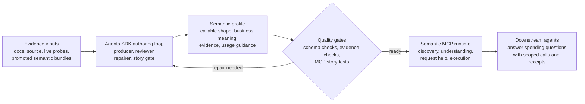

# gov-gpt

`gov-gpt` is an evidence-backed semantic MCP for the USAspending API.

The project gives coding and analysis agents the context they need to work with
federal spending data: discover the right endpoint, understand the business
meaning, build or repair a request, inspect evidence, make scoped live calls,
and interpret the result.

## Product Goal

USAspending has many useful endpoints, and the hard part is turning transport
surfaces into reliable federal-spending analysis. The API surface mixes request
fields, nested filters, pagination, exports, geography, time periods, awards,
accounts, and response measures that carry business meaning.

`gov-gpt` is the semantic layer between USAspending endpoints and the agent
trying to reason about them. It captures what each endpoint means, which
questions it supports, how to call it safely, how to recover from visible API
errors, and which caveats matter when interpreting the response.

## Current Status

As of May 20, 2026, the repository is aligned around the clean forward
architecture:

- The active authoring workflow lives in `scripts/agents` and uses the OpenAI
  Agents SDK.
- The runtime MCP lives in `scripts/mcp` and exposes generic semantic tools for
  discovery, inspection, request help, bounded calls, evidence, and usage
  guidance.
- The promoted MCP surface currently contains one clean Semantic Profile V2
  bundle: `v2__search__spending_by_transaction`.
- The promoted bundle validates with documentation, source-code, live-probe,
  and derived-check evidence.
- The MCP runtime includes `usaspending.callEndpoint`, which makes the actual
  USAspending API call after basic request preflight.
- `make verify` passes against the current surface.
- Scale-out means re-authoring additional endpoints through the current
  producer, review, story, and promotion loop.

## Functional Architecture



## How It Works

1. Evidence comes from documentation, source behavior, promoted semantic
   bundles, and live USAspending probes. Each source contributes useful context,
   and the bundle records confidence and uncertainty explicitly.
2. The Agents SDK drives the authoring loop. A producer agent investigates an
   endpoint, reconciles contradictions, probes live behavior, and writes the
   semantic profile. Reviewer and repair agents challenge the result from the
   perspective of evidence quality and downstream MCP usability.
3. The semantic profile captures both the callable API shape and the analytical
   meaning: what the endpoint is for, which question it can answer, what the
   request fields mean, what the response measures represent, which caveats
   matter, and which evidence backs those claims.
4. Generic gates check structure, evidence links, basic request shape, MCP
   loading, and story usability while endpoint-specific meaning stays in the
   agent-authored bundle.
5. Story agents use the promoted MCP as downstream users and report reusable
   semantic learnings: handoff fragility, measure interpretation, dashboard
   safety, response shape, request construction, workflow sequencing, and
   runtime affordance needs.
6. Once the profile is ready, the MCP runtime exposes it as a semantic
   interface: search for the right capability, inspect meaning and evidence,
   construct and preflight requests, make scoped live calls, and return semantic
   execution receipts from agent-authored affordances.

The Agents SDK is the production loop. The product is the validated semantic
knowledge that the MCP serves to another agent.

## MCP Tools

The runtime exposes a semantic tool surface:

- `usaspending.findEndpoints`
- `usaspending.findConcepts`
- `usaspending.findWorkflows`
- `usaspending.getEndpointSchema`
- `usaspending.getEndpointSemantics`
- `usaspending.getAnalysisPacket`
- `usaspending.getRequestTemplate`
- `usaspending.listRequestFields`
- `usaspending.validateRequest`
- `usaspending.explainValidationError`
- `usaspending.callEndpoint`
- `usaspending.getEvidence`
- `usaspending.getUsageGuide`

`usaspending.callEndpoint` makes a live USAspending API call through the
semantic endpoint contract. Its response includes the raw API payload, the
normalized request, semantic validation output, semantic execution receipts,
and known caveats from the bundle.

## What The MCP Gives An Agent

The MCP experience lets a downstream agent move through a spending question in
a grounded way:

- discover the endpoint or workflow that matches the user's intent
- understand the endpoint's business purpose and analytical grain
- see which request fields are required, optional, risky, or poorly supported
- distinguish documented facts from observed facts and known contradictions
- build or repair a valid request before or after a scoped live API call
- inspect evidence for material claims
- execute scoped calls and interpret the response in context
- receive structured handoff values, measure warnings, and recommended
  follow-up calls when the bundle declares those affordances

The semantic MCP should tell an agent what a field means, when to use it, which
evidence supports it, and which caveat matters for the analysis.

## Semantic Profile V2

Each endpoint profile preserves the information another agent needs to use the
endpoint responsibly:

- callable request and response shape
- business purpose
- analytical grain, such as award, transaction, geography, agency, account,
  time period, or export job
- important measures, dimensions, filters, sort behavior, pagination, joins, and
  workflow boundaries
- live availability and known failure modes
- contradictions between docs, source, promoted semantic bundles, and live
  behavior
- evidence and confidence status for important claims
- practical guidance for suitable and unsuitable analytical uses

The durable bundle has exactly four files:

```text
endpoint.json
semantics.json
evidence.jsonl
usage.md
```

Uncertainty is part of the profile. The system preserves facts as documented,
observed, contradicted, unavailable, inferred, or unknown, then lets future
agents decide when additional probing matters for a specific story.

## Operating Model

The model owns endpoint understanding. It investigates, reconciles, probes, and
explains what the endpoint means.

Deterministic code owns the artifact contract. It validates structure, checks
evidence, enforces basic request safety, loads the MCP surface, and reports
clear failures when a profile misses the contract.

The runtime uses a guidance-first posture. Basic preflight catches generic
shape, location, required-field, enum, host, and timeout issues. Richer endpoint
knowledge lives in usage guidance, caveats, examples, evidence, semantic
receipts, and recoverable live API errors.

Forward evidence sources are documentation, source code, live probes,
derived checks, review reports, and MCP story gates. The orchestration framework
can evolve while the evidence-backed semantic contract remains the source of
truth.

## Design Principles

- Build for agent use and real analysis.
- Treat evidence as part of the product.
- Preserve uncertainty explicitly.
- Keep endpoint-specific meaning in semantic bundles.
- Prefer semantic guidance and API-error recovery while the system scales.
- Tie successful test calls to useful federal spending stories.
- Promote explicit gaps, contradictions, and caveats into durable artifacts.

## Verification

```bash
make verify
```

The verification gate runs Agents SDK typecheck/tests/smoke, MCP
typecheck/tests, promoted-bundle validation, MCP server smoke, and MCP client
smoke.
