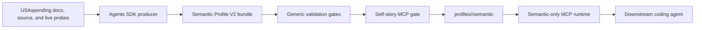
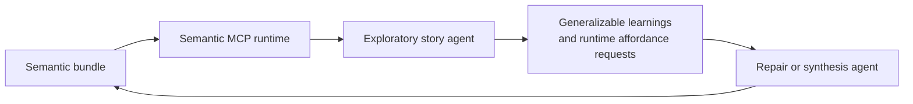

# Architecture

`gov-gpt` has one forward-looking product shape: an evidence-backed semantic
MCP for the USAspending API.

The MCP is not a thin HTTP wrapper. Its source of truth is a promoted Semantic
Profile V2 bundle that lets a coding agent discover an endpoint, understand its
business meaning, construct a valid request, inspect evidence, make a bounded
live call, and interpret the response.

## System Shape



## Active Packages

- `scripts/agents`
  Agents SDK workflow for producer, reviewer, repairer, frontier story tests,
  run-root validation, full-access shell tools, and promotion.
- `scripts/mcp`
  Semantic-only MCP runtime, promoted-bundle loader, request validator, bounded
  live caller, smoke client, and promoted-bundle validator.
- `src/agent/core`
  Shared Semantic Profile V2 schema.
- `profiles/<slug>/semantic`
  Promoted semantic bundles.

There is no active raw-profile runtime and no legacy generation pipeline kept
for compatibility.

## Artifact Contract

Each endpoint bundle has exactly four durable files:

```text
endpoint.json
semantics.json
evidence.jsonl
usage.md
```

`endpoint.json` contains the callable contract, availability, request facts,
response facts, request templates, validation warnings, behavior notes, and
evidence references.

`semantics.json` contains business purpose, analytical grain, entities,
measures, dimensions, suitable questions, not-suitable-for cases, joins,
workflows, and caveats.

`evidence.jsonl` records documentation, source-code, live-probe, derived-check,
review, story-gate, and retired-artifact observations.

`usage.md` is prose for a downstream coding agent. It must be derived from the
JSON artifacts and evidence, not from private reasoning or prompt narration.

## Agentic Workflow

The producer is expected to reason from the available materials and author the
semantic bundle. Deterministic code provides generic gates only:

- schema validation
- evidence-reference checks
- availability evidence checks
- request preflight validation
- MCP loading and smoke checks
- self-story gates
- promotion checks

The workflow intentionally gives the agent broad local command, filesystem,
environment, and network access inside the configured run. The control point is
the artifact contract and validation gates, not a restricted command allowlist.

Producer completion is in-loop:

1. write the four bundle files
2. call `validate_semantic_bundle`
3. repair validation failures
4. run purposeful live probes when useful
5. update evidence and artifacts
6. call `run_self_story_gate`
7. repair owned blocker/major story gaps
8. call `list_output_files`
9. call `finalize_validated_bundle`

Validation alone is not completion.

## MCP Runtime

The MCP registers generic semantic tools:

- discovery: `findEndpoints`, `findConcepts`, `findWorkflows`
- inspection: `getEndpointSchema`, `getEndpointSemantics`,
  `getAnalysisPacket`, `getUsageGuide`, `getEvidence`
- request support: `getRequestTemplate`, `listRequestFields`,
  `validateRequest`, `explainValidationError`
- bounded execution: `callEndpoint`

It also registers semantic resources under `usaspending://semantic/...`.

The runtime must not hard-code endpoint-specific semantics. Endpoint-specific
meaning belongs in the bundle.

`callEndpoint` returns a semantic execution receipt in addition to the raw live
response. The receipt is generated only from agent-authored bundle declarations:

- handoff values extracted from declared `semanticAffordances.handoffKeys`
- measure warnings from declared `semanticAffordances.measureInterpretations`
- recommended follow-ups from declared `semanticAffordances.recommendedFollowups`

This lets the MCP make important semantic handles visible without adding
endpoint-specific runtime branches.

## Exploratory Learning Loop

Story agents are not only acceptance tests. They are exploratory MCP users that
try to answer real analysis questions through the promoted MCP and report
generalizable semantic learnings.

The loop is:



Story reports distinguish one-off narrative facts from reusable MCP learnings,
such as handoff fragility, measure interpretation, dashboard safety, response
shape, request construction, workflow sequencing, and evidence gaps.

## Verification

Use the narrowest checks for small changes. For repo-level architecture changes:

```bash
npm --prefix scripts/agents run typecheck
npm --prefix scripts/agents run test
npm --prefix scripts/agents run smoke
npm --prefix scripts/mcp run typecheck
npm --prefix scripts/mcp run test
scripts/mcp/bin/validate-semantic-bundles
scripts/mcp/bin/smoke-server
scripts/mcp/bin/smoke-client
```

`make verify` runs the same shipping gate.
